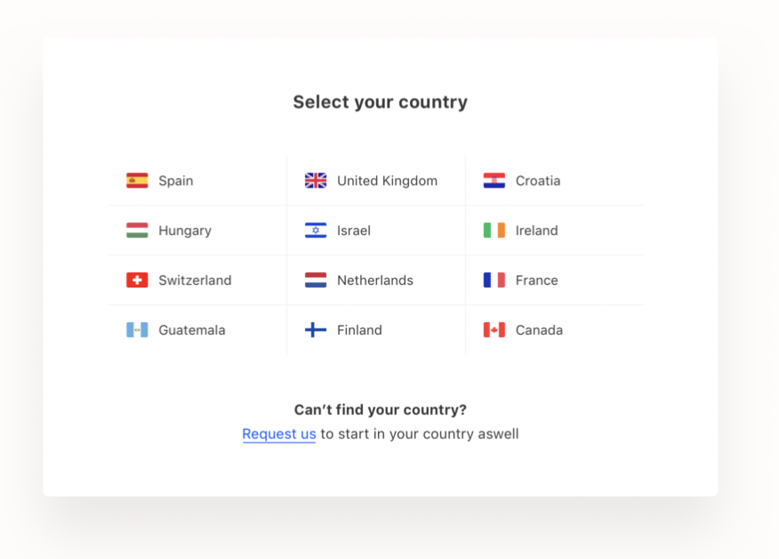

# Getting Started with Countries Project

### `npm start`

Runs the app in the development mode.\
Open [http://localhost:3000](http://localhost:3000) to view it in your browser.

The page will reload when you make changes.\
You may also see any lint errors in the console.

### `1. Find error`

 
 

### `2. Finish the project according to the following design`

 
 

